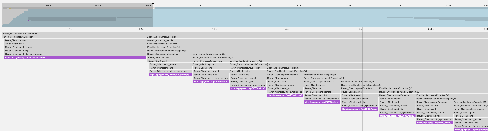

## Repro case for infite-loop in exception_handlers

This repository aims to reproduce the following issue:



Required:

 - a (recent) working docker/docker-compose setup
 - a valid new relic license for the PHP extension

Create a file named `docker-compose.override.yml` with the following contents:

``` yaml
version: '3.3'
services:
  php:
    build:
      args:
        - nr_license_key=YOUR-LICENSE-KEY
    environment:
      - SENTRY_DSN=YOUR-SENTRY-DSN
```

Reproduction steps:

``` bash
docker-compose up --build -d

# first request will succeed
curl localhost:8000

# subsequent requests will get stuck in an infinite loop
curl localhost:8000
```
